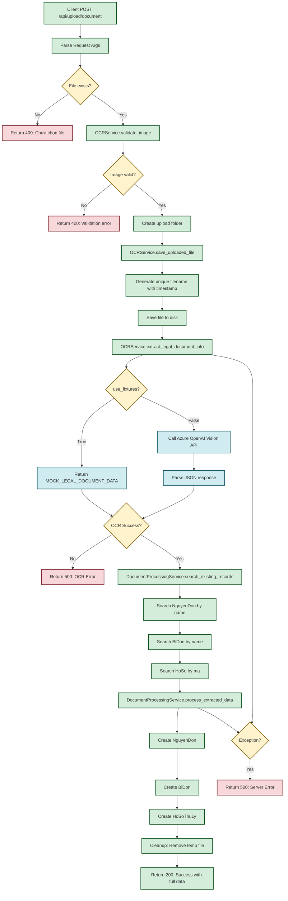
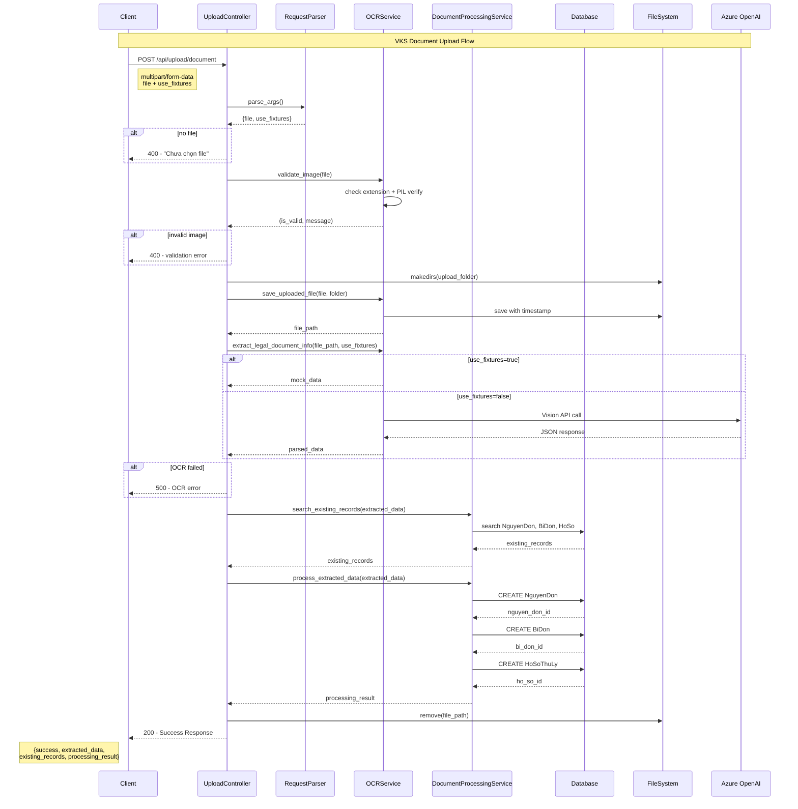
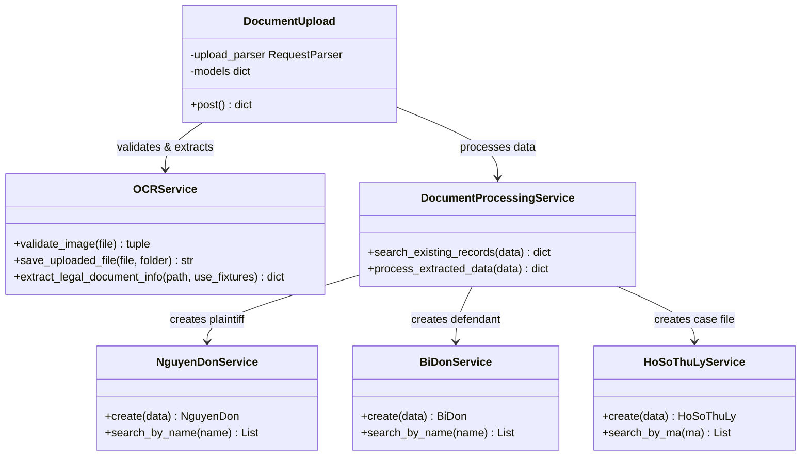
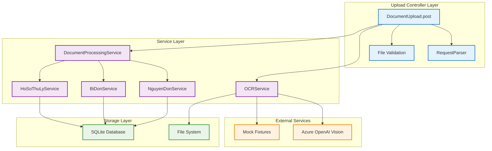
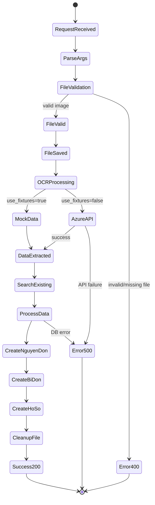

# Upload Controller - Mermaid Diagrams

## 1. Function Flow Diagram

## 2. Sequence Diagram

## 3. Class Diagram

## 4. Component Diagram

## 5. State Diagram

## Summary

Các diagram này mô tả:

1. **Flowchart**: Luồng logic chi tiết với các nhánh decision
2. **Sequence**: Tương tác giữa các components theo thời gian
3. **Class**: Cấu trúc và relationships giữa các classes
4. **Component**: Kiến trúc tổng thể và dependencies
5. **State**: Các trạng thái và transitions của request

Mỗi diagram cung cấp góc nhìn khác nhau về cùng một function `post(self)` trong DocumentUpload controller.
