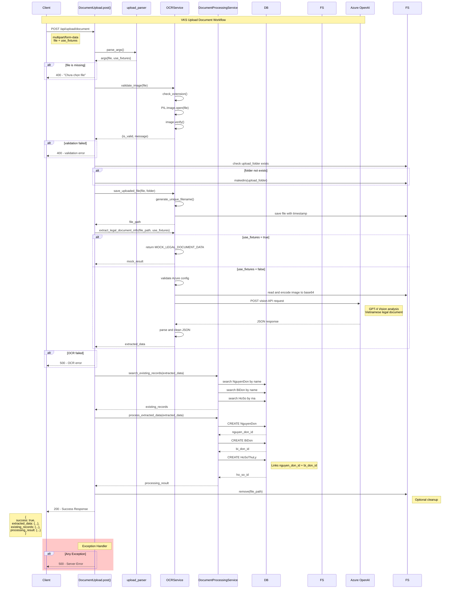

## Sequence Diagram Analysis

### **Flow Overview:**
1. **Request Processing** - Parse multipart form data
2. **File Validation** - Check image format using PIL
3. **File Upload** - Save with unique timestamp filename
4. **OCR Processing** - Extract data (Mock or Azure OpenAI)
5. **Database Processing** - Save NguyenDon → BiDon → HoSo
6. **Cleanup** - Remove temporary file
7. **Response** - Return comprehensive result

### **Key Decision Points:**
- **File Validation**: PIL image verification
- **OCR Mode**: Mock data vs Azure OpenAI Vision
- **Database Transaction**: Sequential creation with foreign keys
- **Error Handling**: Try-catch at each major step

### **Data Flow:**
```
multipart/form-data → FileStorage → PIL validation → 
Disk storage → OCR analysis → Database entities → 
JSON response
```

### **Error Scenarios:**
- Missing file → 400
- Invalid image → 400  
- OCR failure → 500
- Database error → 500
- General exception → 500

This sequence diagram shows the complete flow of the document upload and processing workflow in the VKS system.
